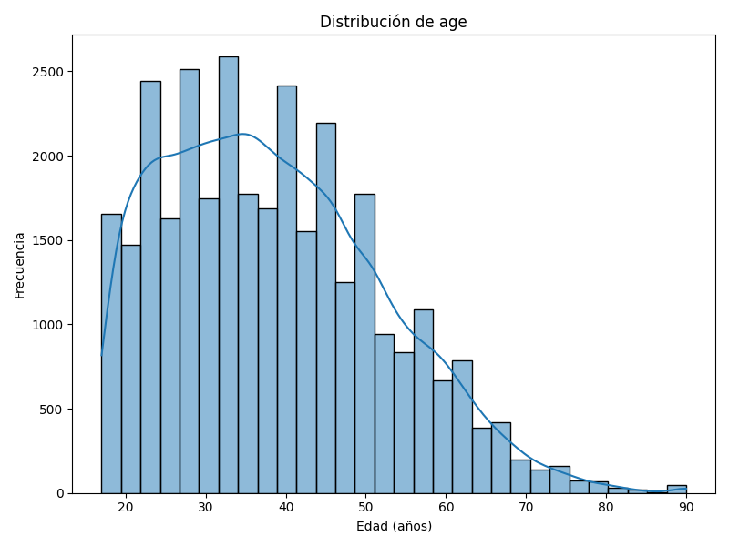
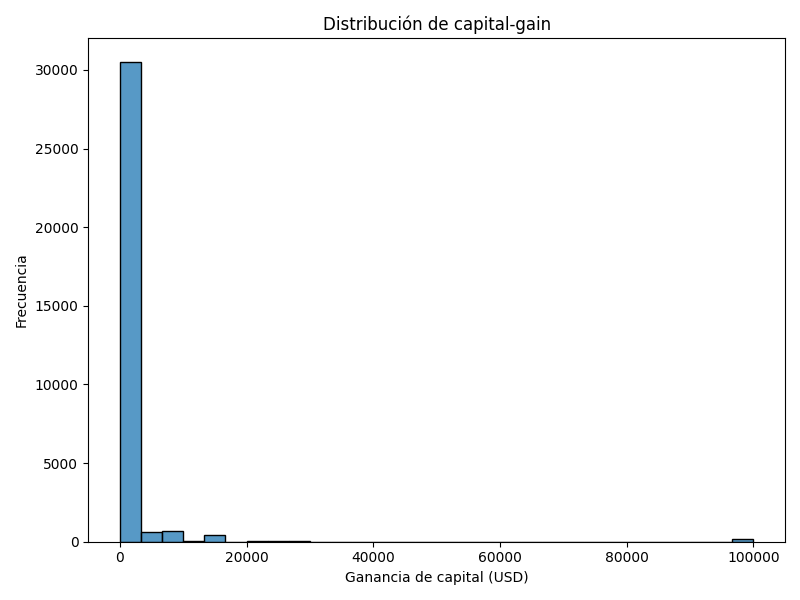
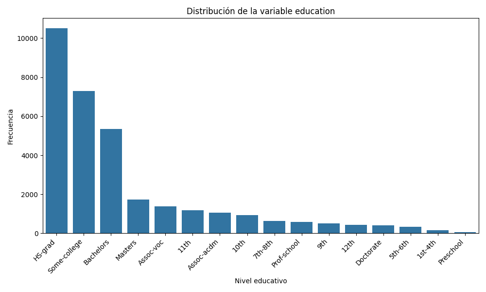
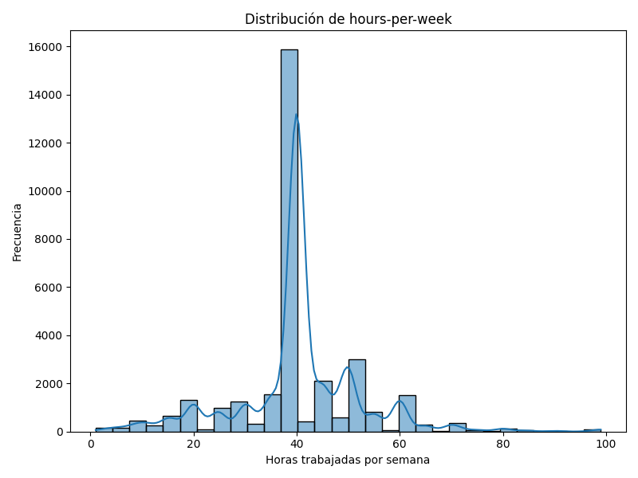

# Adult‑Income‑Analysis

**Análisis exploratorio y modelado preliminar del conjunto de datos Adult (Censo de EE. UU. 1994)** para predecir si una persona percibe ingresos superiores a 50.000 USD anuales, a partir de variables socio-demográficas.

> Proyecto: *Análisis Exploratorio de los Datos*  
> Autor: **Andrei Ionut Hrisca**  
> Fecha: *4 de mayo de 2025*

---

## 📌 Tabla de Contenido

1. [🧾 Descripción](#🧾-descripción)  
2. [📁 Estructura del Proyecto](#📁-estructura-del-proyecto)  
3. [⚙️ Requisitos e Instalación](#️⚙️-requisitos-e-instalación)  
4. [🚀 Ejecución Rápida](#🚀-ejecución-rápida)  
5. [📜 Scripts Disponibles](#📜-scripts-disponibles)  
6. [📊 Resultados y Gráficos](#📊-resultados-y-gráficos)  
7. [📂 Dataset](#📂-dataset)  
8. [📌 To-Do / Próximos Pasos](#📌-to-do--próximos-pasos)  
9. [👨‍💻 Autor](#👨‍💻-autor)  
10. [📄 Licencia](#📄-licencia)

---

## 🧾 Descripción

Este proyecto realiza un análisis exploratorio del **conjunto de datos Adult** del UCI Machine Learning Repository, que contiene información sobre individuos adultos del censo de EE.UU. de 1994. El objetivo es estudiar la distribución de variables clave y construir las bases para un modelo predictivo que clasifique si los ingresos de una persona superan los **50 000 USD anuales**.

### Objetivos:
- Limpiar y preparar los datos.
- Analizar distribuciones de variables relevantes.
- Explorar correlaciones entre variables numéricas y categóricas.
- Visualizar los datos para entender patrones y sesgos potenciales.

---

## 📁 Estructura del Proyecto

```bash
├── data/
│   └── adult.csv                  # Dataset original
├── notebooks/
│   └── exploratory-analysis.ipynb # Análisis exploratorio interactivo
├── scripts/
│   ├── analysis.py                # Análisis general
│   ├── plot_age.py                # Gráfico distribución de edad
│   ├── plot_capital.py            # Gráfico de capital gain
│   ├── plot_education.py          # Frecuencia de educación
│   └── plot_hours.py              # Gráfico de horas trabajadas
├── generated-graphs/
│   ├── Grafico1-distribucion-edad.png
│   ├── Grafico2-distribucion-capital-gain.png
│   ├── Grafico3-distribucion-education.png
│   └── Grafico4-distribucion-hours-per-week.png
├── requirements.txt
└── README.md
```

---

## ⚙️ Requisitos e Instalación

### 1. Clona el repositorio:
```bash
git clone https://github.com/AndreiHrisca/Adult-Income-Analysis.git
cd Adult-Income-Analysis
```

### 2. Crea un entorno virtual (opcional pero recomendado):
```bash
python -m venv venv
source venv/bin/activate  # En Windows: venv\Scripts\activate
```

### 3. Instala dependencias:
```bash
pip install -r requirements.txt
```

### Requisitos principales:
- `invoke`
- `numpy`
- `pandas`
- `matplotlib`
- `scikit-learn`
- `jupyter`

---

## 🚀 Ejecución Rápida

### Para generar todos los gráficos automáticamente:
```bash
invoke all
```

### O ejecutar scripts individuales:
```bash
python scripts/grafico1_age.py
python scripts/grafico2_capital.py
...
```

### Para abrir el notebook interactivo:
```bash
jupyter notebook notebooks/exploratory-analysis.ipynb
```

---

## 📜 Scripts Disponibles

| Script | Descripción |
|--------|-------------|
| `analysis.py` | Análisis completo de datos |
| `grafico1_age.py` | Gráfico de distribución de edades |
| `grafico2_capital.py` | Gráfico de capital gain |
| `grafico3_education.py` | Gráfico de frecuencia de nivel educativo |
| `grafico4_hours.py` | Gráfico de horas trabajadas por semana |

---

## 📊 Resultados y Gráficos

| Gráfico | Descripción |
|--------|-------------|
|  | Distribución de la variable `age` |
|  | Distribución de `capital_gain` |
|  | Frecuencia de niveles educativos (`education`) |
|  | Distribución de `hours_per_week` |

---

## 📂 Dataset

**Fuente:**  
Becker, B. & Kohavi, R. (1996). Adult [Dataset].  
UCI Machine Learning Repository.  
📎 [https://doi.org/10.24432/C5XW20](https://doi.org/10.24432/C5XW20)

---

## 📌 To-Do / Próximos Pasos

- [ ] Generar API para consultar los datos del dataset.
- [ ] Visualizar los graficos desde el browser mediante Front con Angular.
- [ ] Ingeniería de características.
- [ ] Modelos de clasificación (Logistic Regression, Random Forest, etc.).
- [ ] Evaluación de modelos (Accuracy, F1, ROC-AUC).
- [ ] Matriz de correlación y reducción de dimensionalidad.
- [ ] Validación cruzada y tuning de hiperparámetros.
- [ ] Deployment de modelo como microservicio.

---

## 👨‍💻 Autor

**Andrei Ionut Hrisca**  
Estudiante de Ingeniería Informática  
📍 Madrid, España  
🔗 [LinkedIn](https://www.linkedin.com/in/andreiionuthrisca/) | [GitHub](https://github.com/AndreiHrisca)

---
